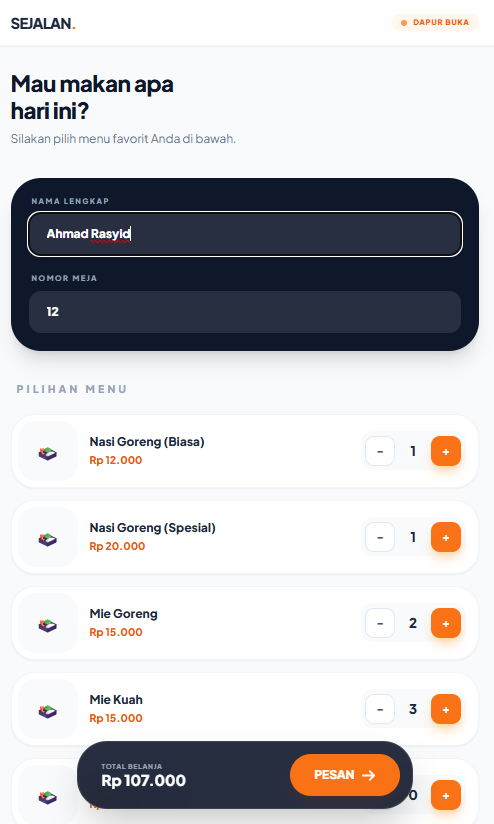
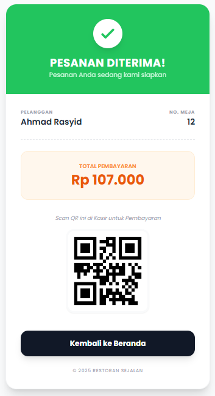
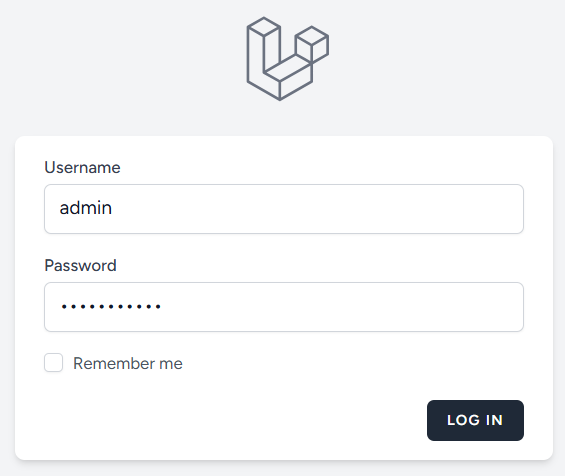
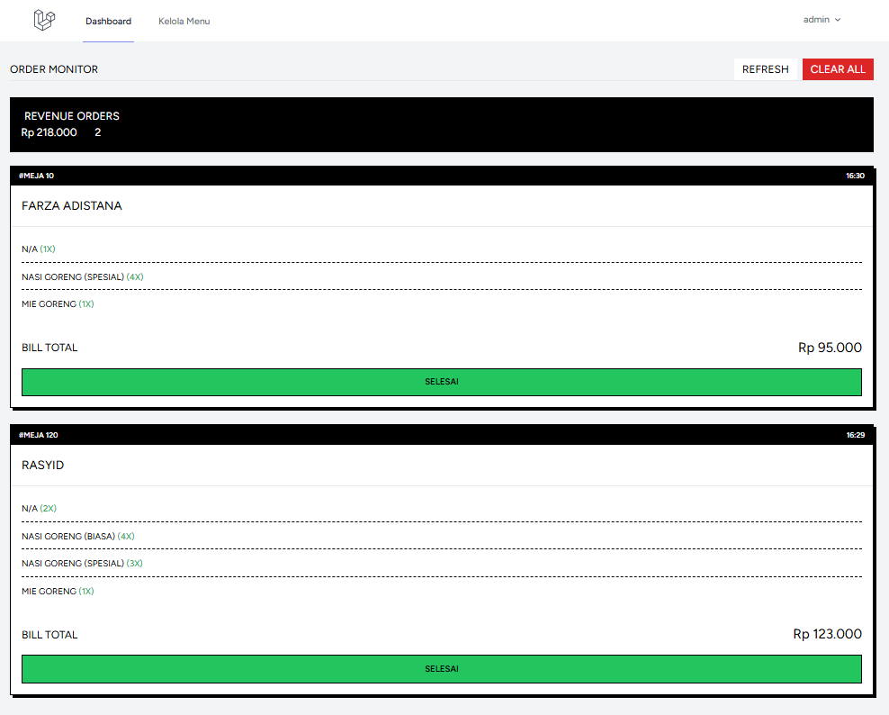
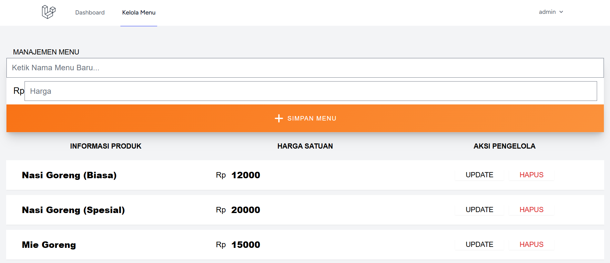

**Nama Kelompok 5**
-Ahmad Rasyid T.R 2413030081
-Martha Clarissa Bertha Wearulun 2413030035
-Silvia Aura Ramadhani 2413030025
-riska oktavia 2413030028
# 🍱 VPOS - Industrial Order Monitor

[](https://laravel.com)
[](https://tailwindcss.com)

**VPOS (Visual Point of Sale)** adalah dashboard monitor order restoran yang dirancang dengan estetika **Neo-Brutalist Industrial**. Berfokus pada kecepatan baca, kontras tinggi, dan efisiensi kerja kasir/dapur.

---

## 📸 Preview Tampilan

### 🍱 Dashboard Order Monitor
| Halaman Utama Order | Tampilan Order | Tampilan Akhir dan Pembayaran |
| :---: | :---: | :---: |
|  |  |  |

---

### 💵 Management Kasir & Menu
| Login Admin | Dashboard Real-Time Kasir | Edit Menu |
| :---: | :---: | :---: |
|  |  |  |
---

## ✨ Fitur Utama
* **Industrial Hard-Square UI**: Desain tanpa radius sudut (siku-siku) untuk kesan tegas dan profesional.
* **Live Menu Summary**: Otomatis menjumlahkan total unit per jenis menu dari seluruh antrian meja untuk memudahkan dapur.
* **Real-time Monitoring**: Sinkronisasi data otomatis setiap 15 detik agar tidak ada orderan yang terlewat.
* **Compact Info Grid**: Layout kartu yang efisien untuk memantau banyak meja sekaligus dalam satu layar.
* **Quick Management**: Fitur "Selesai" per meja dan "Clear All" untuk mereset seluruh antrian dengan cepat.

---

## 🛠️ Tech Stack
* **Backend:** PHP & Laravel.
* **Frontend:** Tailwind CSS & Blade Templating.
* **Font:** Plus Jakarta Sans (Extra Bold).

---

## 🚀 Instalasi Cepat
1. Clone repositori ini:
   ```bash
   git clone [https://github.com/asepkerenn/restoran-order-monitor.git](https://github.com/asepkerenn/restoran-order-monitor.git)
